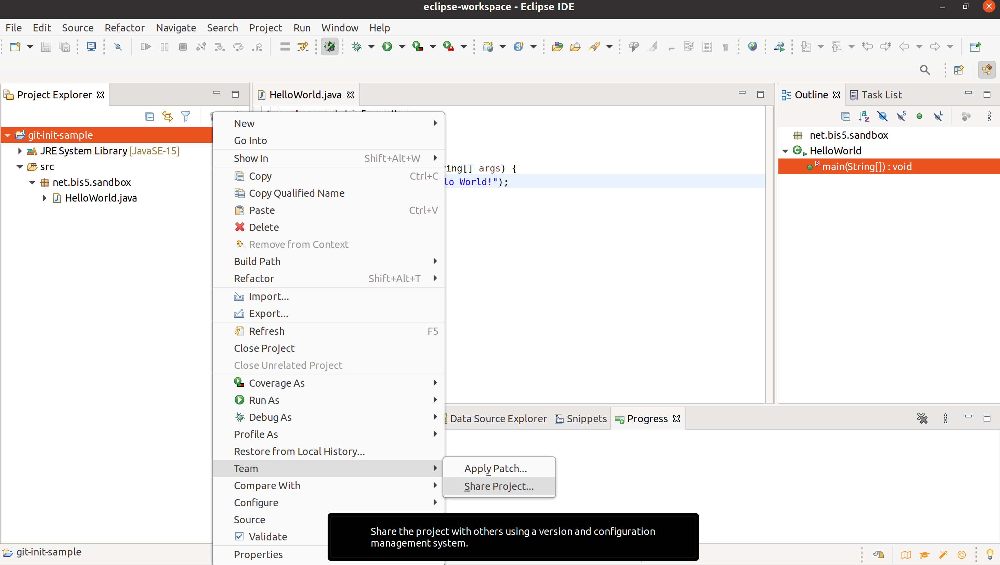
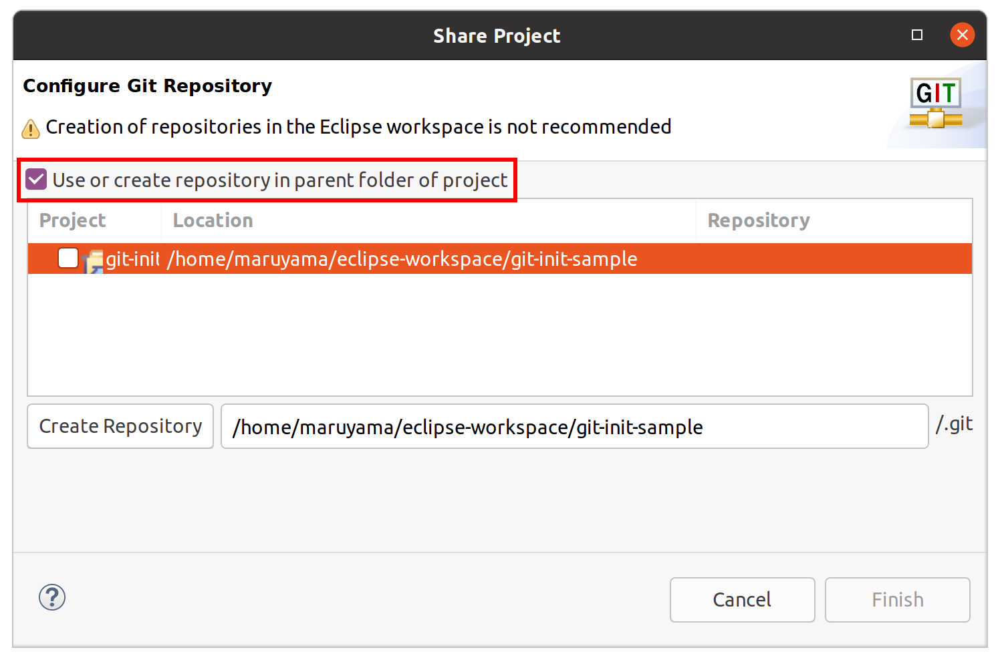
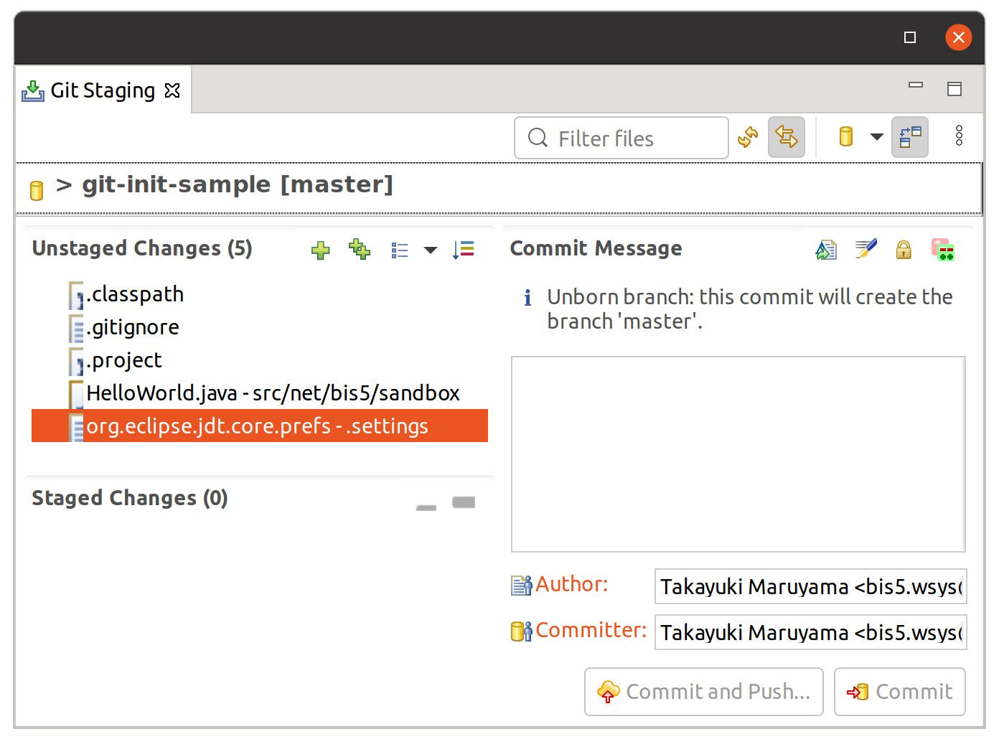
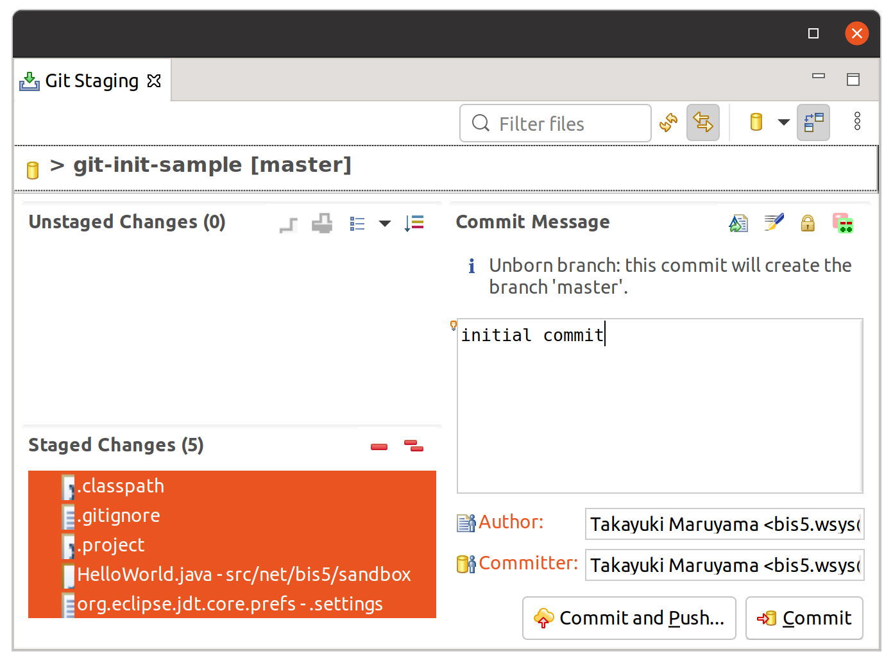
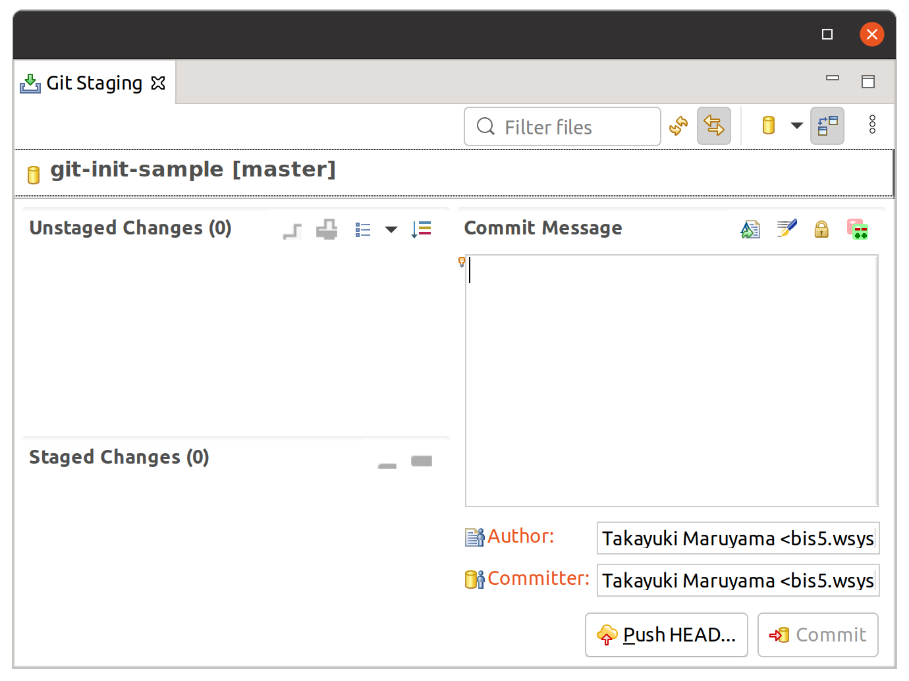
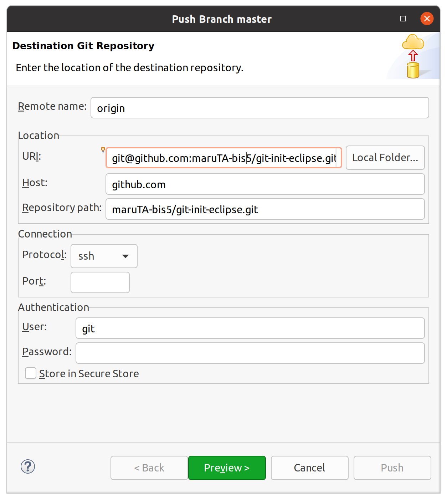
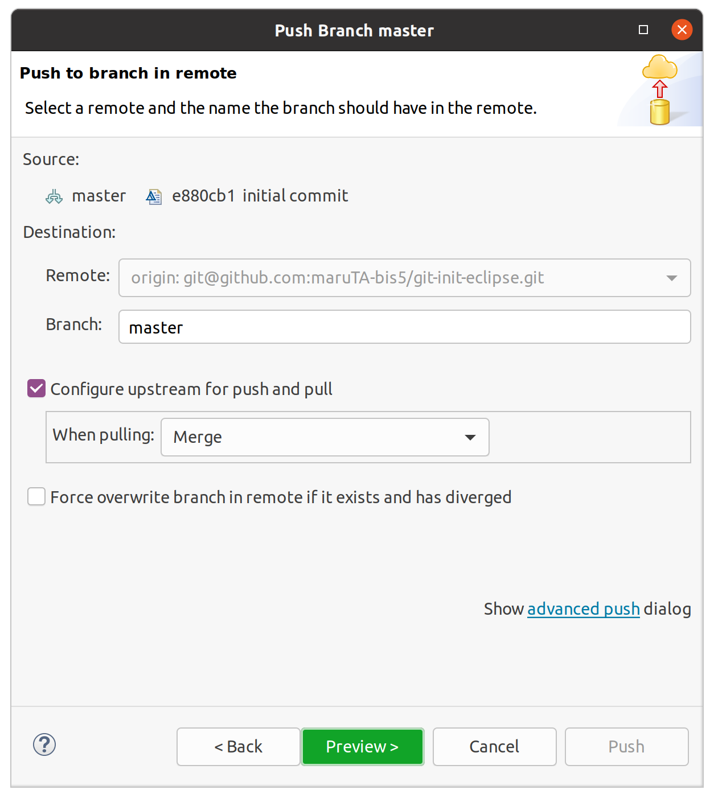
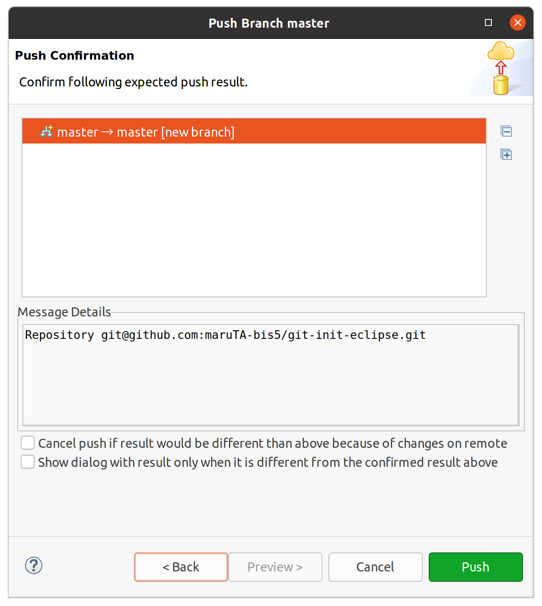
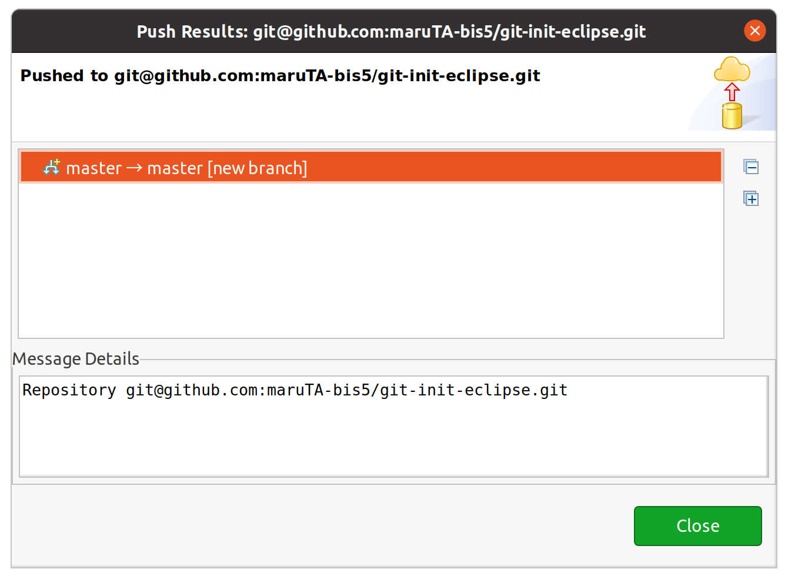

<!-- wp:paragraph -->

前提: Gitの<code>user.name</code>, <code>user.email</code>が適切に設定されていること。

<!-- /wp:paragraph -->

<!-- wp:paragraph -->

この記事の手順で作成したリポジトリは <a href="https://github.com/maruTA-bis5/git-init-eclipse ">https://github.com/maruTA-bis5/git-init-eclipse </a>です。

<!-- /wp:paragraph -->

<!-- wp:paragraph -->

1. EclipseのProject Explorerより、Git管理したいプロジェクトを右クリックし、Team &gt; Share Project...を選択する。

<!-- /wp:paragraph -->

<!-- wp:paragraph -->

2. Share Projectダイアログの<code>Use or create repository in parent folder of project</code>を選択する。

<!-- /wp:paragraph -->

<!-- wp:paragraph -->

3. 対象のプロジェクトを選択し、<code>Create Repository</code>ボタンをクリックする。

<!-- /wp:paragraph -->

<!-- wp:paragraph -->

4. <code>Finish</code>をクリックする。

<!-- /wp:paragraph -->

<!-- wp:paragraph -->

ここまででローカルリポジトリが作成されます。次は初回のコミットを行います。

<!-- /wp:paragraph -->

<!-- wp:paragraph -->

5. <code>Git Staging</code>ビューを開く。

<!-- /wp:paragraph -->

<!-- wp:paragraph -->

6. <code>Unstaged Changes</code>のファイルを<code>Staged Changes</code>に移動し、<code>Commit Message</code>を入力して<code>Commit</code>をクリックする。 このとき、<code>*.class</code>ファイルは表示されていませんが、<code>*.class</code>ファイルが出力されるディレクトリは<code>.gitignore</code>に記載されているため無視されます。他にも無視するファイルがあれば<code>.gitignore</code>に追記しておきます。 ※<code>.gigignore</code>はProject Explorerには表示されないので、このタイミングで修正するか、Git Repositoriesビューから開く必要があります。

<!-- /wp:paragraph -->

<!-- wp:paragraph -->

初回コミットが完了したら、リモートリポジトリにpushします。(リモートリポジトリでの管理が不要ならここまで)

<!-- /wp:paragraph -->

<!-- wp:paragraph -->

7. Git Stagingビューの<code>Push HEAD</code>ボタンをクリックする。

<!-- /wp:paragraph -->

<!-- wp:paragraph -->

8. <code>Location</code> &gt; <code>URI</code>にリモートリポジトリのURL、認証が必要なら<code>Authentication</code>を入力し<code>Preview &gt;</code>をクリックする。 画像ではSSHを使用する形で入力していますが、HTTP(S)でも問題ありません。 パスワード認証が必要な場合は、<code>Authentication</code>を入力しておきます。

<!-- /wp:paragraph -->

<!-- wp:paragraph -->

9. ブランチの指定は基本的に変更しなくて良いはず。前のステップで入力した認証情報に誤りがあればこの段階でエラーが表示されるので、一度戻って修正する。問題なければ<code>Preview &gt;</code>をクリックする。

<!-- /wp:paragraph -->

<!-- wp:paragraph -->

10. pushのプレビューを確認して<code>Push</code>をクリックする。

<!-- /wp:paragraph -->

<!-- wp:paragraph -->

11. pushが完了するとpush結果が表示される。失敗した場合もこのダイアログが表示されるので、必ず<code>Message Details</code>の内容を確認する。

<!-- /wp:paragraph -->

