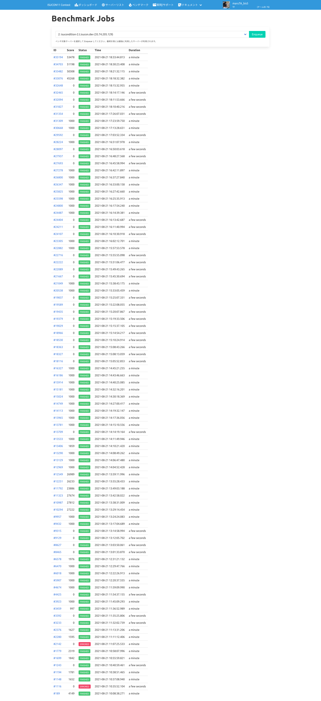
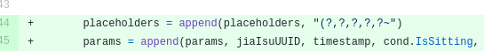

<!-- wp:paragraph -->

2021/08/21に開催されたISUCON11 予選にチーム「TF」で出場しました。 ISUCON (Iikanjini Speed Up CONtest) についてはこちら→ <a rel="noreferrer noopener" href="https://isucon.net" target="_blank">https://isucon.net</a>

<!-- /wp:paragraph -->

<!-- wp:heading {"level":3} -->
<h3>変更履歴</h3>
<!-- /wp:heading -->

<!-- wp:paragraph -->

・2021/08/27 18:41: <a rel="noreferrer noopener" href="https://isucon.net/archives/56021246.html" target="_blank">ISUCON11 オンライン予選 全てのチームのスコア（参考値）</a>の順位に更新(68位→67位)

<!-- /wp:paragraph -->

<!-- wp:heading -->
<h2>チーム</h2>
<!-- /wp:heading -->

<!-- wp:paragraph -->

どちらも初参加の2人で参加しました。言語はGolangを選択しました。

<!-- /wp:paragraph -->

<!-- wp:list -->
<ul><li><a rel="noreferrer noopener" href="https://github.com/maruTA-bis5" target="_blank">maruTA-bis5</a> (<a rel="noreferrer noopener" href="https://twitter.com/maruTA_bis5" target="_blank">@maruTA_bis5</a>) ←me<ul><li>普段はJava/PostgreSQLで仕事してる人。GolangわからんけどJavaで再実装する時間はない</li></ul><ul><li>開発担当</li></ul></li><li>yulis452 <ul><li>AWSエンジニアのはずなのに最近物理のインフラを触っている人。開発わからん</li><li>情報担当</li></ul></li></ul>
<!-- /wp:list -->

<!-- wp:heading -->
<h2>予選結果</h2>
<!-- /wp:heading -->

<!-- wp:paragraph -->

運営の計測による最終スコアは53398点、全体の67位で予選敗退しました。 ベンチマークの履歴は以下。ちなみに初回ベンチ = 10:08:38 の4149点は、当時暫定1位でした。やったね。

<!-- /wp:paragraph -->

<!-- wp:heading -->
<h2>やったこと</h2>
<!-- /wp:heading -->

<!-- wp:heading {"level":3} -->
<h3>事前準備</h3>
<!-- /wp:heading -->

<!-- wp:paragraph -->

yulis452は開発ノータッチの方針が決まっていたので、手を動かす練習としてISUCON10予選、10本戦、11事前講習をときました。GolangはMattermostのソースを少し読み書きした程度だったので実装面は割と怪しめでしたが、初動での計測ツール設定をある程度Ansibleで行うことを検討していたので、playbookを整備して、早く開発に入れる準備をできた、と最後の練習を終えた時点では考えていました。

<!-- /wp:paragraph -->

<!-- wp:heading {"level":3} -->
<h3>予選当日</h3>
<!-- /wp:heading -->

<!-- wp:paragraph -->

※当日はサーバーリストの表示順で上から1号機〜3号機と呼称していたため、以下同様に記載します

<!-- /wp:paragraph -->

<!-- wp:paragraph -->

予選ライブでISUCONDITIONの紹介を見て、いざ始めようとansible-playbookを叩いたらいきなりエラー。pt-query-digestのためのslowlog設定が/etc/mysql/mysql.conf.d/mysqld.cnfを前提にしていたところ、MySQLではなくMariaDBがインストールされていてコケました。 今思えばそこでMySQLに入れ替えるともできたと思いますが、なぜかpt-query-digestを諦めてMariaDBのまま進む方針としました。この時点ですでにテンパってますね・・・

<!-- /wp:paragraph -->

<!-- wp:paragraph -->

ansibleでの設定が終わった段階で1号機に対してベンチマークを実行するとなぜかfailしました。同じ状態の2号機・3号機を指定したらfailしなかったので、以降は2号機をベンチ対象として指定する方針にしました。(後で運営からアナウンスがありましたが、ベンチマーカーの不具合があったようです。該当したのが弊チームのみという・・・)

<!-- /wp:paragraph -->

<!-- wp:paragraph -->

DBを3号機に移し、New Relic APMを設定したところで12時、スコアは1000点でした。

<!-- /wp:paragraph -->

<!-- wp:paragraph -->

前日に調達してあったコンビニ弁当を食べつつ、<a rel="noreferrer noopener" href="https://github.com/maruTA-bis5/isucon11-qualify/commit/1391082d676c9ba24f176f0fbd190f495fc66be1" target="_blank">インデックスを追加</a>したところで27000点台まで伸び、その後細かい修正をいくつか行っていますが、それ以上はすぐには伸びませんでした。

<!-- /wp:paragraph -->

<!-- wp:paragraph -->

14時前、当日一番のやらかしポイントが到来します。 <a rel="noreferrer noopener" href="https://github.com/maruTA-bis5/isucon11-qualify/commit/bece0826949cf71a2ed50bebe11bcba64c1c008b" target="_blank">https://github.com/maruTA-bis5/isucon11-qualify/commit/bece0826949cf71a2ed50bebe11bcba64c1c008b</a> 複数回INSERTするならバルクインサートにしてしまえ、という発想の修正でしたが、

<!-- /wp:paragraph -->

<!-- wp:paragraph -->

")"を"~"にtypoするという痛恨のミス。 これによってisu_conditionが全くINSERTされなくなり、加点要素がないためにスコアが1000点のまま変動しなくなりました。 多分冷静ではなかったのでしょう。この後色々な修正を試みますがいつまで経ってもtypoに気づかず、ポータル障害明けの18時過ぎになって<a rel="noreferrer noopener" href="http://daa4d50bd24eb23336705a18e90b63dae0930a06" target="_blank">ようやく気がつきました</a>。。。 紆余曲折あったときの修正の一部が原因でfailしていたのもあったのでrevertして、fail -&gt; 45268点に復帰。すでに残り時間も少なく、これ以上コードに修正を加えるのはリスクがあると感じたため、これ以上コードに大きく手を入れるのは止めることにしました。

<!-- /wp:paragraph -->

<!-- wp:paragraph -->

最後の調整としてDBのコネクション数を増加させてから、諸々ログ・計測を止めた状態で51198点。再起動試験としてsudo reboot後にISUCONDITIONにアクセスしてデータが入っているのを確認した後、再度ベンチマークを回して最高点の53478点で終了しました。最終スコアとは違いますが、ひとまず初参加ながらスコアを残せそうで一安心です。

<!-- /wp:paragraph -->

<!-- wp:heading -->
<h2>感想</h2>
<!-- /wp:heading -->

<!-- wp:paragraph -->

初手MariaDBや、午前中から数万点のスコアを出している他チームを見て、かなり焦ってしまったことが諸々のミスにつながっているように思います。普段の仕事でも、プレッシャーがかかるとミスを起こしがちなので、いかにプレッシャーを感じずに進めるかが重要そうです。

<!-- /wp:paragraph -->

<!-- wp:paragraph -->

yulis452は開発はできないものの、情報整理を得意としているので、今回はマニュアルの確認とベンチ結果の考察をお願いしていました。特にマニュアルについては、「このデータについて加点に関係するか？」という聞き方でも適切に加点内容を説明してもらえたこと、当日マニュアルとは別にアプリケーションマニュアルも存在していたことを指摘してくれたことで非常に助かりました。 とはいえ、私自身もそこまで開発の手が早いわけではないですし、ISUCONの参考実装に頻出の言語に慣れていないので、もう1人開発担当がいれば例の凡ミスにもすぐ気がつけたかもしれないなぁ。

<!-- /wp:paragraph -->

<!-- wp:paragraph -->

予選当日に使用したリポジトリは以下に公開しています。 <a rel="noreferrer noopener" href="https://github.com/maruTA-bis5/isucon11-qualify" target="_blank">https://github.com/maruTA-bis5/isucon11-qualify</a>

<!-- /wp:paragraph -->