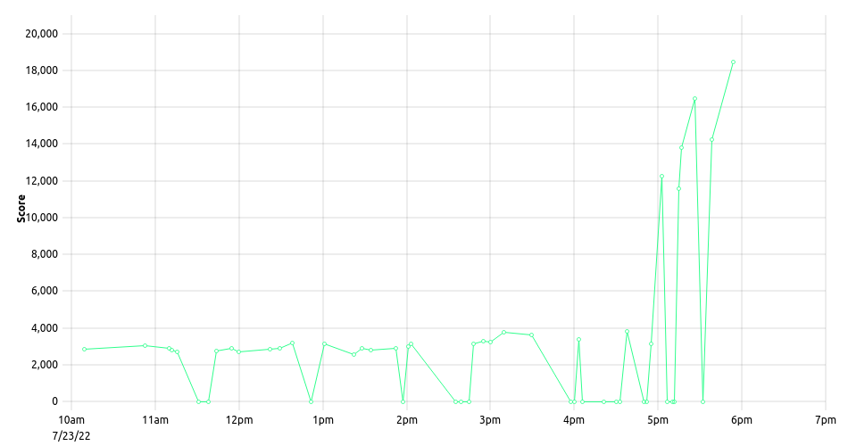
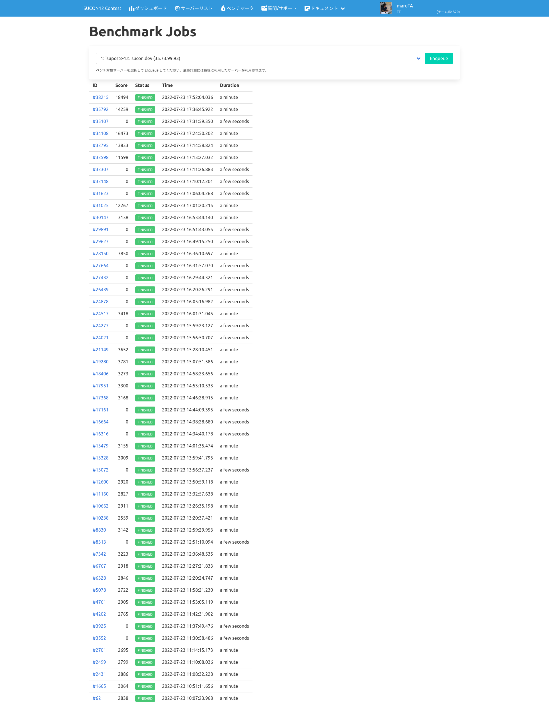

2022/07/23に開催されたISUCON11 予選にチーム「TF」で出場しました。
ISUCON (Iikanjini Speed Up CONtest) についてはこちら→ https://isucon.net

### メンバー
前回と同じメンバーの2人チームでした。
- [maruTA](https://github.com/maruTA-bis5) ([@maruTA_bis5](https://twitter.com/maruTA_bis5)) ←me
    - 普段はJava + PostgreSQLで仕事している人
    - ISUCON 11 SQLのtypoで2時間溶かした前科有り
    - 開発担当
- yulis
    - AWSエンジニアだったはずだがオンプレミスも世話している人
    - 目grepが得意
    - 情報担当

### 使ったもの
- 実装言語: golang
    - 今回はJavaの実装も提供されましたが、普段パフォーマンスを重視した開発をしていない()ので、今回はgolangで。
- 各種監視: Grafana + Prometheus + Loki + Tempo + OpenTelemetry
    - 前回はNewRelicを使いましたが、業務で使っているツールに寄せる、という意図で選定
- その他: ansible, kataribe, pt-query-digest

### 結果
最終スコア18494点、[参考値一覧](https://isucon.net/archives/56838276.html)によると35位で予選敗退しました。

### やったこと
リポジトリは [https://github.com/maruTA-bis5/isucon12-qualify](https://github.com/maruTA-bis5/isucon12-qualify)、ベンチマークのログは [#4](https://github.com/maruTA-bis5/isucon12-qualify/issues/4)にあります。

- アプリケーションをdocker composeでビルド・起動していたのを剥がした
    - `network_mode: host`だったのでNWのオーバーヘッドはなかったみたいだが、ベンチマーク回す前のコンテナビルド時間が気になった
- OpenTelemetryの計装
    - Tracesをapp -> otelcol -> Tempoに転送してGrafanaで確認できるように
- ID採番の回数を減らせないか試行錯誤
    - MySQLの`auto_increment_increment`をいじって回数を減らす、とか実装したがあまり改善していない気もする
    - 後から考えるとアプリ側で採番したほうが良かったか
- ranking等時間がかかる集計をする際に、テナントDBのファイルを一時ファイルにコピーしておいて、そちらを参照する→整合性チェックを通らなかったのでrevert
- `visit_history(tenant_id, competition_id, player_id)`にインデックス作成
- スコア入稿時に最新スコアをMySQLに登録して、rankingでflockを取得しないように
    - 今回唯一のスコアの"崖"がこの修正。結局他の修正は微増する程度でしたなぁ
- 最終的に1号機=アプリ、2号機=最新スコアDB、3号機=adminDBの構成

### 感想
SQLiteで面食らってしまったのもあり、後半までほとんどスコアが伸びませんでした。
前回はSQLのtypoに気づかずに時間を溶かしたが、今回はfailしたらすぐrevertする、エラーログをちゃんと見る、という2点を心がけて、スコアが出せない時間はそこまで続きませんでしたが、flockが重いことに気づいていながら取り切ることも出来ず。
最新スコアの切り出しをもう少し早く実施できていれば、あと4000点あれば予選突破できたことも考えると、非常に悔しいポイントでした。
瞬発力を上げるためにも、次回開催に向けて練習あるのみ。

今回、ベンチマーク・ポータルは非常に安定していたので集中してチューニングに取り組むことが出来ました。
運営の皆様、ありがとうございました。
次こそは予選突破・・・!

**追記(2022/07/27 8:52 JST)** ベンチマーク履歴のスクリーンショットを載せ忘れていたので追加

