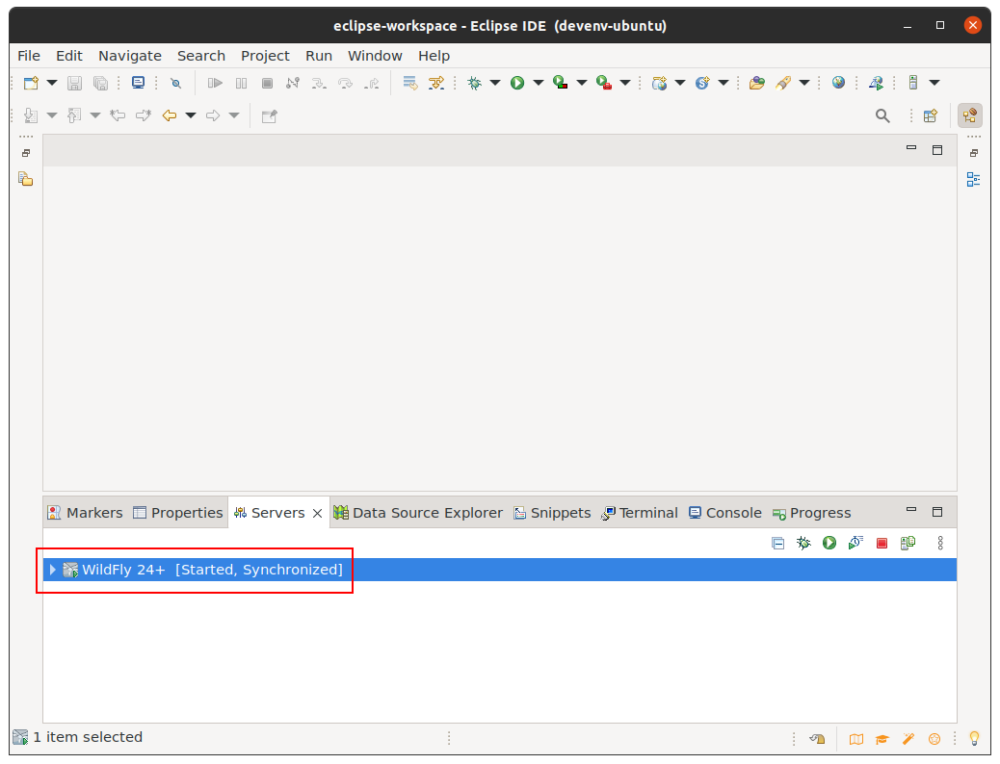
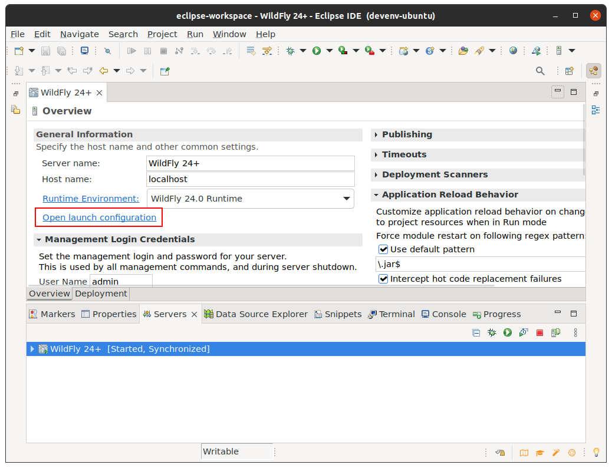
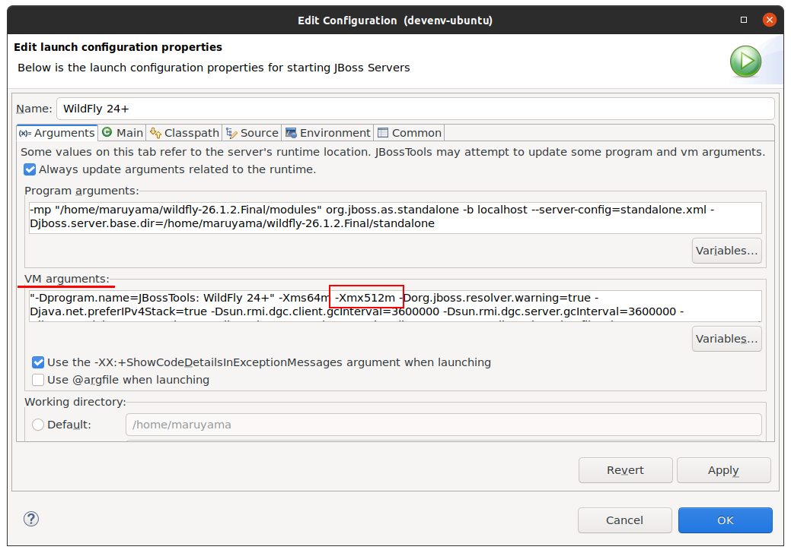

[Eclipse](https://eclipseide.org)を使用して[WildFly](https://www.wildfly.org)(やJBoss AS)で動作するアプリケーションを開発する場合、[JBoss Tools](https://tools.jboss.org)プラグインを使用するのが定番かと思います。

WildFlyを起動する際に使用するVM引数はJBoss Toolsにハードコードされていまして、例えばWildFly 24以降だと以下の通りに設定されます。
```
"-Dprogram.name=JBossTools: WildFly 24+" -Xms64m -Xmx512m -Dorg.jboss.resolver.warning=true -Djava.net.preferIPv4Stack=true -Dsun.rmi.dgc.client.gcInterval=3600000 -Dsun.rmi.dgc.server.gcInterval=3600000 -Djboss.modules.system.pkgs=org.jboss.byteman -Djava.awt.headless=true "-Dorg.jboss.boot.log.file=/path/to/wildfly-26.1.2.Final/standalone/log/boot.log" "-Dlogging.configuration=file:/path/to/wildfly-26.1.2.Final/standalone/configuration/logging.properties" "-Djboss.home.dir=/path/to/wildfly-26.1.2.Final" -Dorg.jboss.logmanager.nocolor=true --add-exports=java.desktop/sun.awt=ALL-UNNAMED --add-exports=java.naming/com.sun.jndi.ldap=ALL-UNNAMED --add-opens=java.base/java.lang=ALL-UNNAMED --add-opens=java.base/java.lang.invoke=ALL-UNNAMED --add-opens=java.base/java.lang.reflect=ALL-UNNAMED --add-opens=java.base/java.io=ALL-UNNAMED --add-opens=java.base/java.security=ALL-UNNAMED --add-opens=java.base/java.util=ALL-UNNAMED --add-opens=java.base/java.util.concurrent=ALL-UNNAMED --add-opens=java.management/javax.management=ALL-UNNAMED --add-opens=java.naming/javax.naming=ALL-UNNAMED --add-exports=java.base/sun.nio.ch=ALL-UNNAMED --add-exports=jdk.unsupported/sun.misc=ALL-UNNAMED --add-exports=jdk.unsupported/sun.reflect=ALL-UNNAMED --add-modules=java.se -Djboss.bind.address.management=localhost 
```

ヒープサイズの指定を見ると、なんと **-Xmx512m** なんですよ。  
[2019年からEclipse本体に2GB割り当てられるようになった](https://git.eclipse.org/r/plugins/gitiles/epp/org.eclipse.epp.packages/+/e8f1046a8d269dec3fab103b47db4fd9a42a28d0%5E%21/packages/org.eclipse.epp.package.jee.product/epp.product)のに、WildFlyにはたったの512MB。

業務開発だと512MBはあっという間に`OutOfMemoryError`を引き起こしてしまうので、割当を増やしておきましょう。
1. Serversビューから、対象のWildFlyをダブルクリック
    
2. 出てきたビューの`Open launch configuration`リンクをクリック
    
3. `VM Arguments`を編集して、OK
    

これでOK。起動すれば変更した引数が起動時に渡されるので、例えば`-Xmx2g`と指定すれば2GBの最大ヒープ・サイズを指定できます。
