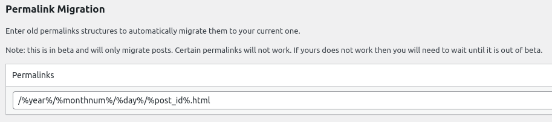

長らくWordPressを使用していた本ブログですが、この度Hugo + GitHub Pagesに移行しました。
理由はいくつかありますが、管理しているVPSを減らそうと思いまして、その一環です。

## 記事の移行
最初は以下のSQLで投稿を抽出して、WordPress固有のタグを取り除いた上でMarkdownに書き換え(手作業)て行こうかと思っていたのですが、最近の投稿はJetpackのMarkdownブロックで書いており、そこから素のMarkdownを抜き出すのは面倒そうなのでやめました・・・
```sql
-- 読みやすいように適宜改行
select ID, post_content
from wp_posts
where post_status = 'publish'
and post_type = 'post'
into outfile '/var/lib/mysql-files/posts.txt'
fields terminated by '
' -- ←改行区切り
optionally enclosed by '';
```

そこまで記事が多くないので()、WordPressの編集画面からコピペして、適宜調整する方法を取りました。気づいた範囲で、リンク切れも直しています。  
上記のSQLではカテゴリ・タグを取得していないので、SQLで抽出するなら`wp_term*`テーブルからもデータを持ってくる必要がありますね。

## パーマリンクの維持
元々、`/%year%/%month%/%day%/%page_id%.html`という形式のパーマリンクを使用していたのですが、Hugo移行後にも維持するには拡張子部分が邪魔だとわかりまして、
事前に`/posts/%year%/%month%/%day%/%page_id%/`に変更しました。  
ただ、このままだと他サイトからのリンクや検索エンジンからの流入が途絶えてしまうため、WordPressにRedirectionプラグインを導入し、旧リンクは301で新リンクにリダイレクトするように設定しました。
(設定は2022/09/23に実施しています)  


Hugo移行後にもリダイレクトを維持する必要はありますが、SEO対策としての301リダイレクトはもう良いだろうということで、Front Matterに`aliases`を指定しています。

## `linkCard` ショートコード
リンク先の情報を以下のようにカードとして表示するショートコードを作りました。忘れなければこれでリンク書くようにします。



OGPの情報を持ってきているだけですが、取得するためのAPIをAzure Functionにデプロイしています。
